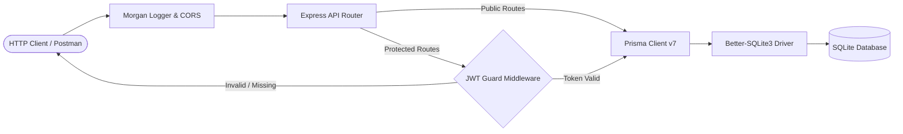
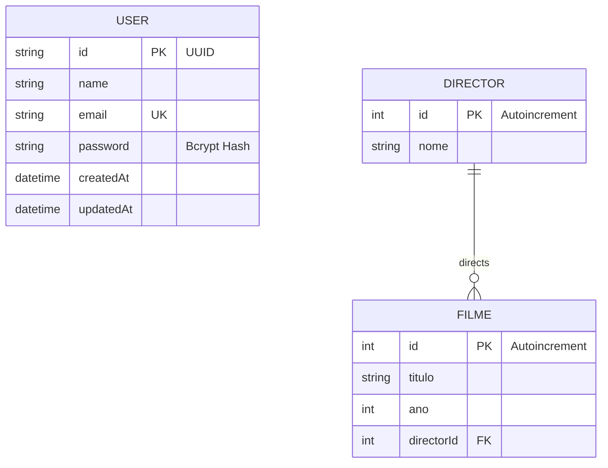

# 🎬 Movie Catalog API

<p align="center">
  
  
  
  
  
  
  
  
</p>

> A high-performance, modular RESTful API engineered for cinema catalog curation, director filmographies, and secure user management. Built on **Node.js**, **Express 5**, **Prisma ORM 7**, **Better-SQLite3**, and protected with stateless **JSON Web Tokens (JWT)**.

---

## ⚡ Architecture & Request Flow



---

## 📊 Database Schema (ERD)



---

## 🚀 Key Features

* **Complete Relational CRUD:** Full management of movies linked to directors with automatic foreign-key verification.
* **Dual-Language Routing:** Native support for Portuguese (`/filmes`, `/directores`) and English aliases (`/movies`, `/directors`).
* **Stateless Security:** Password hashing via **Bcrypt** (10 salt rounds) and endpoint protection with **Bearer JWT tokens**.
* **Modern ORM Layer:** Uses **Prisma v7** with the `@prisma/adapter-better-sqlite3` native engine for blazing-fast local queries.
* **Defensive Validation:** Strict ID checks, validation of foreign keys, and clean, standardized JSON error responses.
* **Automated Seed Engine:** Instant database population with sample directors (Nolan, Stallone, Tarantino), movies, and a pre-configured admin user.
* **Interactive Postman Suite:** Pre-configured collection featuring automated environment variable management for tokens.

---

## 📑 API Endpoints Reference

### 🔐 Authentication

| Method | Endpoint | Access | Description | Payload Example |
| :--- | :--- | :--- | :--- | :--- |
| `POST` | `/auth/signup` | Public | Register a new user | `{"name": "Afonso", "email": "afonso@example.com", "password": "Pass"}` |
| `POST` | `/auth/signin` | Public | Authenticate & receive JWT token | `{"email": "afonso@example.com", "password": "Pass"}` |

### 🎬 Directors (`/directores` or `/directors`)

| Method | Endpoint | Access | Description | Payload Example |
| :--- | :--- | :--- | :--- | :--- |
| `GET` | `/directores` | Public | Retrieve all directors with their movies | _None_ |
| `GET` | `/directores/:id` | Public | Retrieve a specific director by ID | _None_ |
| `POST` | `/directores` | 🔒 **Bearer JWT** | Create a new director | `{"nome": "Steven Spielberg"}` |

### 🎥 Movies (`/filmes` or `/movies`)

| Method | Endpoint | Access | Description | Payload Example |
| :--- | :--- | :--- | :--- | :--- |
| `GET` | `/filmes` | Public | Retrieve all movies with director details | _None_ |
| `GET` | `/filmes/:id` | Public | Retrieve a single movie by ID | _None_ |
| `POST` | `/filmes` | 🔒 **Bearer JWT** | Add a new movie linked to a director | `{"titulo": "Oppenheimer", "ano": 2023, "directorId": 1}` |
| `PUT` | `/filmes/:id` | 🔒 **Bearer JWT** | Update movie details | `{"titulo": "Oppenheimer (IMAX)", "ano": 2023}` |
| `DELETE` | `/filmes/:id` | 🔒 **Bearer JWT** | Delete a movie by ID | _None_ |

---

## 🛠️ Quickstart & Local Setup

### 1. Prerequisites
* **Node.js** v20+ 
* **npm** v10+

### 2. Clone the Repository
```bash
git clone https://github.com/Afonsojlc/movie-catalog-api.git
cd movie-catalog-api
```

### 3. Install Dependencies
```bash
npm install
```

### 4. Configure Environment Variables
Copy the template file to `.env`:
```bash
cp .env.example .env
```
Ensure your `.env` contains:
```env
SERVER_PORT=4242
DATABASE_URL="file:./prisma/dev.db"
JWT_SECRET="your_jwt_secret_key_here"
```

### 5. Initialize & Seed Database
```bash
# Push Prisma schema to SQLite
npx prisma db push

# Populate with sample directors, movies, and demo user
npm run seed
```

> **Pre-configured Demo Credentials:**
> * **Email:** `demo@example.com`
> * **Password:** `Password123!`

### 6. Run the Server
```bash
# Production mode
npm start

# Development mode (auto-reload with nodemon)
npm run dev
```
The server will boot at `http://localhost:4242`.

---

## 📬 Postman Collection Testing

A fully structured Postman collection is included in the root directory: [`movie-catalog-api.postman_collection.json`](movie-catalog-api.postman_collection.json).

### How to use:
1. Open **Postman** and click **Import**.
2. Drag and drop `movie-catalog-api.postman_collection.json`.
3. Run the **`Sign In (Login)`** request.
4. ✨ **Magic Feature:** The collection contains an automated test script that automatically extracts the returned JWT token and stores it in the `{{token}}` collection variable.
5. All protected requests (`POST`, `PUT`, `DELETE`) will immediately work without any manual token copying!

---

## 📁 Repository Structure

```text
movie-catalog-api/
├── docs/
│   └── tutorial-setup-node-prisma.md  # Architectural notes & reference guide
├── prisma/
│   ├── schema.prisma                  # Prisma data models (User, Director, Filme)
│   └── seed.js                        # Database population script
├── .env.example                       # Environment variables template
├── .gitignore                         # Git exclusion rules (DBs, node_modules, .env)
├── movie-catalog-api.postman_collection.json # Ready-to-use Postman test suite
├── package.json                       # Project manifests and lifecycle scripts
├── server.js                          # Core Express application and route handlers
└── README.md                          # API documentation
```

---

## 👤 Author

**Afonso Carvalho**
* GitHub: [@Afonsojlc](https://github.com/Afonsojlc)
* LinkedIn: [Afonso Carvalho](https://www.linkedin.com/in/afonso-carvalho-64796328a/)

---

## 📄 License

This project is licensed under the [MIT License](LICENSE).
